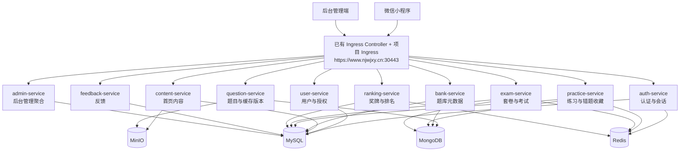

# 后端架构设计文档

> 本文基于微信小程序“考试类 + 课程类刷题系统”的业务范围设计后端架构。系统采用微服务拆分，数据库使用 MySQL，缓存使用 Redis，题库使用 MongoDB，图片和视频使用 MinIO，所有服务和中间件部署在已有 Kubernetes 集群的 `zuoti` namespace 中。

## 1. 架构目标

- 支持微信小程序通过统一 HTTPS 入口访问后端。
- 支持微信小程序自动获取 `openid` 并以 `openid` 作为用户主键，用户可维护头像、昵称、邮箱等身份资料。
- 支持小程序内用户角色管理，角色分为游客、普通用户、管理员、超级管理员。
- 支持管理员按用户授权访问题库。
- 支持考试类、课程类题库的维护、练习、考试、错题、收藏、成绩、趋势统计。
- 支持首页教学视频和学习推广内容管理。
- 支持题目离线缓存和缓存版本更新。
- 支持后台管理端维护用户授权、题库、章节、题目、套卷、反馈、系统配置。
- 密码、密钥、数据库连接串、对象存储密钥等敏感信息不得明文保存在仓库。

## 2. 总体架构



## 3. 外部访问设计

### 3.1 统一入口

小程序前端访问后端使用以下域名和端口：

```text
https://www.njwjxy.cn:30443
```

建议 API 统一使用 `/api` 前缀：

| 类型 | 示例 |
| --- | --- |
| 小程序接口 | `https://www.njwjxy.cn:30443/api/miniapp/...` |
| 后台管理接口 | `https://www.njwjxy.cn:30443/api/admin/...` |
| MinIO 公开资源 | `https://www.njwjxy.cn:30443/zuoti-minio/public-assets/...` |
| MinIO 管理页面 | `https://www.njwjxy.cn:30443/zuoti-minio-console/` |

### 3.2 微信小程序配置

| 配置项 | 值 / 存储方式 |
| --- | --- |
| AppID | `wxb88840bf78c6cd4d` |
| AppSecret | 不允许写入仓库，必须通过 Kubernetes Secret、CI/CD Secret 或外部密钥系统注入 |

### 3.3 Ingress 访问职责

集群中已部署 Ingress Controller，本项目不需要重复部署 Ingress Controller。后端只需要在 `zuoti` namespace 中维护项目自己的 Ingress 资源，将外部入口路由到对应微服务或 API 网关服务。

- HTTPS 终止或转发，Ingress 显式配置 `ingressClassName: nginx`。
- TLS 证书通过 `zuoti` namespace 下的 `ingress-tls` Secret 引用，和已有 `maoning` 项目保持同一域名证书配置方式。
- 路由小程序接口和后台管理接口。
- 路由 MinIO S3 API：`/zuoti-minio(/|$)(.*)` -> `zuoti-minio:9000`。
- 路由 MinIO Console：`/zuoti-minio-console(/|$)(.*)` -> `zuoti-minio:9001`。
- 统一跨域、安全头、请求体大小限制。
- 基础限流和黑名单拦截。
- 将请求转发到 `zuoti` namespace 内的微服务。

## 4. Kubernetes 部署约束

### 4.1 Namespace

所有中间件和微服务均部署在已有 Kubernetes 集群的 `zuoti` namespace：

```text
namespace: zuoti
```

### 4.2 工作负载类型

| 类型 | 建议资源 |
| --- | --- |
| 微服务 | `Deployment` + `Service` |
| MySQL | `StatefulSet` + `PersistentVolumeClaim` |
| Redis | `StatefulSet` + `PersistentVolumeClaim` |
| MongoDB | `StatefulSet` + `PersistentVolumeClaim` |
| MinIO | `StatefulSet` + `PersistentVolumeClaim` |
| Ingress 路由 | 使用已有 Ingress Controller，创建项目 Ingress 资源 |
| 配置 | `ConfigMap` |
| 密钥 | `Secret` |

本地集群当前使用单节点 `local-storage`，没有动态卷 provisioner。部署时需要提前准备本地 PV，供 MySQL、Redis、MongoDB、MinIO 的 StatefulSet PVC 绑定。长期生产部署建议替换为稳定的动态存储或独立持久化存储服务。

### 4.3 服务命名建议

| 服务 | K8s Service 名称 |
| --- | --- |
| API 网关 / 路由入口 | `zuoti-gateway` |
| 认证服务 | `zuoti-auth-service` |
| 用户服务 | `zuoti-user-service` |
| 内容服务 | `zuoti-content-service` |
| 题库服务 | `zuoti-bank-service` |
| 题目服务 | `zuoti-question-service` |
| 练习服务 | `zuoti-practice-service` |
| 考试服务 | `zuoti-exam-service` |
| 排名服务 | `zuoti-ranking-service` |
| 反馈服务 | `zuoti-feedback-service` |
| 后台聚合服务 | `zuoti-admin-service` |
| MySQL | `zuoti-mysql` |
| Redis | `zuoti-redis` |
| MongoDB | `zuoti-mongodb` |
| MinIO | `zuoti-minio` |

### 4.4 当前落地部署优化

当前 `zuoti` namespace 已采用以下部署约定：

| 资源 | 当前配置 |
| --- | --- |
| 业务服务镜像 | `ghcr.io/luxuyuan-candi/njy-zuoti-be:latest` |
| 微服务副本 | 10 个 FastAPI 微服务，默认 `replicas: 2` |
| 探针策略 | `readinessProbe` 延迟 20 秒，`livenessProbe` 延迟 30 秒，避免 Python 应用启动阶段被过早杀掉 |
| API Ingress | `zuoti-ingress`，`ingressClassName: nginx`，TLS Secret 为 `ingress-tls` |
| MinIO S3 Ingress | `zuoti-minio-ingress`，路径 `/zuoti-minio(/|$)(.*)` rewrite 到 `zuoti-minio:9000` |
| MinIO Console Ingress | `zuoti-minio-console-ingress`，路径 `/zuoti-minio-console(/|$)(.*)` rewrite 到 `zuoti-minio:9001` |
| MinIO Console Redirect | `MINIO_BROWSER_REDIRECT_URL=https://www.njwjxy.cn:30443/zuoti-minio-console` |
| MySQL 字符集 | `users` 表使用 `utf8mb4`，保证中文昵称和邮箱资料保存正常 |

部署变更后应执行：

1. `docker build -t ghcr.io/luxuyuan-candi/njy-zuoti-be:latest .`
2. `kubectl apply -k k8s`
3. 使用 `kubectl -n zuoti rollout restart deploy/<service>` 重启使用同一 `latest` 标签的目标服务。
4. 使用 `curl -sk https://www.njwjxy.cn:30443/api/miniapp/content/home` 和 MinIO HTTPS 对象 URL 验证 Ingress。

### 4.5 部署变更维护清单

后续每次涉及部署、域名、证书、存储或服务接口的变更，都应同步检查以下内容：

| 检查项 | 要求 |
| --- | --- |
| 镜像 | 确认 Docker 镜像已重新构建，使用 `latest` 标签时必须触发目标 Deployment 重启 |
| Kustomize | 新增或调整资源后确认 `k8s/kustomization.yaml` 已引用对应 YAML |
| Secret | 真实密钥只允许通过 Kubernetes Secret 注入，不写入 Markdown、代码或 YAML 明文 |
| Ingress TLS | 所有对外 Ingress 必须配置 `ingressClassName: nginx` 和 `tls.secretName: ingress-tls` |
| MinIO 外链 | 小程序、接口返回值和文档统一使用 `https://www.njwjxy.cn:30443/zuoti-minio/...` |
| Console 入口 | MinIO Console 只作为运维入口，公开说明中不得记录真实账号密码 |
| 数据迁移 | 涉及表结构、字符集或索引变更时，同步更新 `db/schema.sql` 和迁移说明 |
| 验证 | 至少验证 Pod 状态、Ingress HTTPS、核心 API、MinIO 对象访问 |

建议验证命令：

```bash
kubectl -n zuoti get pods
kubectl -n zuoti get ingress
curl -sk https://www.njwjxy.cn:30443/api/miniapp/content/home
curl -skI https://www.njwjxy.cn:30443/zuoti-minio/public-assets/images/video-cover.png
```

## 5. 中间件设计

### 5.1 MySQL

用途：

- 用户、管理员、角色、授权关系。
- 题库、课程、章节、套卷等结构化元数据。
- 练习记录、考试记录、错题、收藏、成绩。
- 首页内容配置、反馈、奖牌、排名快照、系统配置。

特点：

- 适合事务型数据和关系查询。
- 作为用户授权和业务状态的主数据源。
- 需要定期备份。

建议库名：

```text
zuoti
```

### 5.2 Redis

用途：

- 登录态、会话 token、验证码或临时授权态。
- 小程序接口限流。
- 热门题库、首页内容、用户授权结果缓存。
- 排名榜单缓存，例如总榜、周榜。
- 考试进行中的临时答题状态。

缓存策略：

- 用户授权缓存需要设置较短 TTL，避免授权变更后长时间不生效。
- 排名榜单可定时刷新或事件触发刷新。
- 关键写操作不能只写 Redis，必须最终落库到 MySQL。

### 5.3 MongoDB

用途：

- 题干、选项、解析、题目扩展字段。
- 题目版本快照。
- 离线缓存包内容。
- 复杂题目结构的扩展预留。

说明：

- 当前只支持单选、多选、判断题，但题目正文、选项、解析适合用文档结构保存。
- MySQL 保存题目索引和归属关系，MongoDB 保存题目正文和版本内容。
- 题目发布后生成版本号，小程序据此判断离线缓存是否需要更新。

### 5.4 MinIO

用途：

- 首页教学视频。
- 推广内容图片、Banner。
- 题目图片。
- 用户头像。
- 后台上传的其他静态资源。

当前第一阶段部署使用统一公开桶：

| Bucket | 用途 |
| --- | --- |
| `public-assets` | 首页视频、推广图片、用户头像等可公开读取资源 |

对象路径约定：

| 对象路径 | 用途 |
| --- | --- |
| `video/zuoti-guide.mp4` | 首页教学视频 |
| `images/video-cover.png` | 首页教学视频封面 |
| `images/promo-*.png` | 首页推广图片 |
| `users/{openid}/avatar-{uuid}.{ext}` | 用户头像 |

访问策略：

- 不建议小程序直接使用 MinIO 内网地址。
- 小程序使用 HTTPS 域名公开地址：`https://www.njwjxy.cn:30443/zuoti-minio/public-assets/...`。
- 后端保存资源时写入 MinIO 内网地址 `zuoti-minio:9000`，对外返回 `MINIO_PUBLIC_BASE_URL + /public-assets/...`。
- 私有资源必须鉴权后访问。
- MinIO Console 单独通过 `https://www.njwjxy.cn:30443/zuoti-minio-console/` 暴露，仅供管理员运维使用，应限制访问来源并定期轮换 root 密码。

## 6. 微服务拆分

### 6.1 auth-service

职责：

- 微信登录。
- 通过微信 `code` 换取 `openid`。
- 使用小程序 AppID `wxb88840bf78c6cd4d` 和通过 Secret 注入的 AppSecret 调用微信服务端接口。
- 用户无需手动登录；小程序启动时自动调用 `wx.login`，后端换取 `openid` 后创建或更新用户记录。
- 生成小程序访问 token，当前第一阶段 token 格式为 `miniapp-openid:{openid}`，后续可替换为签名 JWT 或 Redis 会话。
- 后台管理员登录。

核心身份规则：

- 微信访问小程序的唯一 `openid` 作为用户身份主键，`users.id = users.openid`。
- 用户表中必须保存 `openid`，并对 `openid` 建唯一索引。
- 如后续接入 unionid，可作为跨应用身份辅助字段，不能替代当前小程序 `openid` 的唯一性。
- `auth-service` 只负责身份建立和 token 签发，不保存头像文件。

### 6.2 user-service

职责：

- 小程序用户注册和资料维护。
- 用户授权状态查询。
- 用户头像、昵称、邮箱维护。
- 管理员给用户授权题库或课程。
- 用户奖牌和排名基础资料查询。

核心规则：

- 首次获取 `openid` 时自动创建用户，不需要单独登录注册步骤。
- 头像通过微信原生头像接口选择，前端转为 base64 后提交，后端写入 MinIO 并保存公开 URL。
- 用户重新保存头像时，后端只保留当前正在使用的头像对象，替换后的旧头像文件应从 MinIO 删除。
- 昵称、邮箱保存到 MySQL，`users` 表使用 `utf8mb4` 字符集，保证中文昵称不乱码。
- 已建立身份但未授权用户不能查看题库。
- 授权范围第一阶段建议精确到题库或课程。
- 授权变更后需要清理或刷新 Redis 中的用户授权缓存。
- 前端如果拿着旧 token 请求当前用户资料失败，必须清理本地身份缓存并重新 `wx.login`，不能继续回退展示旧缓存用户。

### 6.3 content-service

职责：

- 首页教学视频配置。
- 学习推广内容、Banner、公告配置。
- 推广内容跳转目标配置。
- 图片、视频上传和资源引用管理。

依赖：

- MySQL 保存内容配置。
- MinIO 保存图片和视频文件。

### 6.4 bank-service

职责：

- 考试类、课程类题库管理。
- 科目、课程、分类、章节、知识点管理。
- 题库上下架和排序。
- 题库版本管理。
- 查询用户可访问的题库列表。

依赖：

- MySQL 保存题库、课程、章节、授权范围等元数据。
- MongoDB 可保存题库版本快照。

### 6.5 question-service

职责：

- 单选、多选、判断题维护。
- 题干、选项、正确答案、解析维护。
- 题目导入。
- 题目发布版本。
- 离线缓存包生成。

依赖：

- MongoDB 保存题目正文。
- MySQL 保存题目索引、章节关系、状态、版本。
- MinIO 保存题目图片。

### 6.6 practice-service

职责：

- 章节练习、随机练习、专项练习。
- 练习作答记录。
- 错题本。
- 题目收藏。
- 错题多次答对自动移出。
- 离线作答数据同步。

依赖：

- MySQL 保存练习记录、错题、收藏。
- MongoDB 查询题目正文。
- Redis 暂存练习状态和幂等提交标记。

### 6.7 exam-service

职责：

- 套卷列表。
- 考试说明。
- 考试开始、答题、交卷。
- 考试成绩。
- 考试解析查看。

依赖：

- MySQL 保存套卷、考试记录、成绩。
- MongoDB 查询题目正文和题目版本。
- Redis 暂存考试中的答题状态和倒计时状态。

### 6.8 ranking-service

职责：

- 总榜。
- 周榜。
- 个人当前排名。
- 奖牌规则计算。
- 用户奖牌获取记录。

依赖：

- MySQL 保存奖牌规则、用户奖牌、排名快照。
- Redis 缓存排行榜。

### 6.9 feedback-service

职责：

- 小程序用户反馈提交。
- 后台反馈列表、处理状态、处理备注。

依赖：

- MySQL 保存反馈数据。

### 6.10 admin-service

职责：

- 后台管理端聚合接口。
- 管理端仪表盘。
- 用户授权、题库管理、内容管理、反馈管理等后台聚合查询。
- 管理员权限校验。

说明：

- `admin-service` 不替代具体业务服务。
- 写操作建议转发或调用对应领域服务，避免业务规则分散。

## 7. 数据分层设计

### 7.1 MySQL 核心表建议

| 表 | 用途 |
| --- | --- |
| `users` | 小程序用户，`id/openid`、昵称、邮箱、头像 URL、角色、授权状态 |
| `admins` | 后台管理员 |
| `roles` | 管理员角色 |
| `admin_roles` | 管理员角色关系 |
| `user_authorizations` | 用户题库或课程授权 |
| `banks` | 题库 |
| `courses` | 课程 |
| `chapters` | 章节 |
| `question_indexes` | 题目索引和 MongoDB 文档引用 |
| `papers` | 套卷 |
| `paper_questions` | 套卷题目关系 |
| `practice_records` | 练习记录 |
| `practice_answers` | 练习答题明细 |
| `mistakes` | 错题本 |
| `favorites` | 题目收藏 |
| `exam_records` | 考试记录 |
| `exam_answers` | 考试答题明细 |
| `home_contents` | 首页视频、推广内容、公告 |
| `medal_rules` | 奖牌规则 |
| `user_medals` | 用户奖牌 |
| `ranking_snapshots` | 排名快照 |
| `feedbacks` | 用户反馈 |
| `system_configs` | 系统配置 |

### 7.2 MongoDB 集合建议

| Collection | 用途 |
| --- | --- |
| `questions` | 题目正文、选项、答案、解析 |
| `question_versions` | 题目版本快照 |
| `offline_packages` | 离线缓存包元数据和题目集合 |
| `bank_snapshots` | 题库发布快照 |

### 7.3 Redis Key 建议

| Key 模式 | 用途 |
| --- | --- |
| `auth:token:{token}` | 小程序登录态 |
| `auth:admin:{token}` | 后台登录态 |
| `user:authz:{userId}` | 用户授权缓存 |
| `rate:miniapp:{openid}` | 小程序接口限流 |
| `exam:session:{examRecordId}` | 考试临时状态 |
| `practice:session:{practiceId}` | 练习临时状态 |
| `ranking:total` | 总榜 |
| `ranking:weekly:{week}` | 周榜 |
| `content:home` | 首页内容缓存 |

## 8. 身份与权限设计

### 8.1 小程序用户身份

- 微信 `openid` 是小程序用户身份主键。
- 当前实现中 `users.id = users.openid`，减少额外用户 ID 映射。
- `users.openid` 必须唯一。
- 小程序启动时，前端通过 `wx.login` 自动获取 code，后端调用微信 `jscode2session` 换取 `openid`。
- 如数据库不存在该 `openid`，创建用户记录。
- 新用户默认角色为 `GUEST`。
- 当前第一阶段默认将身份状态置为 `AUTHORIZED` 便于联调；完整授权规则仍应由管理员授权表控制。
- 管理员授权后，用户才能访问对应题库或课程。

用户资料字段：

| 字段 | 说明 |
| --- | --- |
| `id` | 用户主键，等于 `openid` |
| `openid` | 微信小程序身份 ID |
| `nickname` | 用户配置昵称 |
| `email` | 用户配置邮箱 |
| `avatar_url` | MinIO 公开头像地址 |
| `role` | 用户角色，`GUEST`、`USER`、`ADMIN`、`SUPER_ADMIN` |
| `status` | 用户状态 |

建议用户状态：

| 状态 | 含义 |
| --- | --- |
| `REGISTERED` | 已注册，未授权 |
| `AUTHORIZED` | 已授权 |
| `DISABLED` | 已禁用 |

用户角色：

| 角色值 | 页面展示 | 权限 |
| --- | --- | --- |
| `GUEST` | 游客 | 可建立身份和配置资料，不具备题库授权管理能力 |
| `USER` | 普通用户 | 普通做题用户，题库访问仍由管理员授权控制 |
| `ADMIN` | 管理员 | 可通过小程序“人员管理”将用户配置为普通用户或游客 |
| `SUPER_ADMIN` | 超级管理员 | 可通过小程序“人员管理”将用户配置为管理员、普通用户或游客 |

角色管理规则：

- “我的”页顶部身份模块展示头像、昵称和角色；昵称为空时展示“匿名”。
- 只有 `ADMIN` 和 `SUPER_ADMIN` 可以看到工具区的“人员管理”入口。
- `SUPER_ADMIN` 才能配置 `ADMIN` 权限。
- `ADMIN` 只能配置 `USER` 和 `GUEST` 权限。
- `SUPER_ADMIN` 权限建议通过数据库初始化或运维后台维护，小程序人员管理入口不开放授予超级管理员。
- 不允许用户通过人员管理修改自己的角色，避免误操作导致权限丢失。

### 8.2 用户资料保存流程

用户资料维护由小程序“我的 -> 身份配置”触发，后端按以下顺序处理：

1. 从 `Authorization: Bearer <token>` 解析当前 `openid`。
2. 读取或创建 `users` 记录，禁止使用请求体中的 openid 覆盖当前身份。
3. 校验昵称、邮箱和头像输入；邮箱为空时允许不保存。
4. 如果提交头像 base64，则校验 MIME 类型和大小，生成服务端对象名。
5. 将头像写入 MinIO `public-assets/users/{openid}/avatar-{uuid}.{ext}`。
6. 将昵称、邮箱、头像公开 URL 写入 MySQL。
7. 如果用户已有旧头像且本次头像已替换成功，删除旧头像对应的 MinIO 对象，只保留当前引用文件。
7. 返回最新用户资料，前端刷新本地缓存和“我的”页展示。

资料接口必须满足幂等更新要求：只修改本次提交的字段，未提交字段保持原值。头像上传失败时不得覆盖数据库中已有头像 URL。

### 8.3 管理员身份

- 管理员账号使用独立身份体系，不使用小程序 `openid` 作为管理员登录凭证。
- 管理员密码必须加盐哈希保存，禁止明文保存。
- 建议使用 bcrypt、argon2 或 PBKDF2。
- 管理员登录 token 存入 Redis，并设置过期时间。

### 8.4 题库授权

授权维度建议：

| 维度 | 第一阶段建议 |
| --- | --- |
| 业务类型 | 可选 |
| 题库 | 推荐 |
| 课程 | 推荐 |
| 章节 | 暂缓 |
| 套卷 | 暂缓 |

授权校验必须在后端执行：

- 查询题库列表时过滤未授权题库。
- 查询章节、题目、套卷时校验授权。
- 获取离线缓存包前校验授权。
- 授权失效后拒绝访问，并提示小程序清理对应缓存。

## 9. 接口分组建议

### 9.1 小程序接口

| 分组 | 前缀 |
| --- | --- |
| 登录 | `/api/miniapp/auth` |
| 用户 | `/api/miniapp/user` |
| 首页内容 | `/api/miniapp/content` |
| 题库 | `/api/miniapp/banks` |
| 题目 | `/api/miniapp/questions` |
| 练习 | `/api/miniapp/practice` |
| 考试 | `/api/miniapp/exams` |
| 记录 | `/api/miniapp/records` |
| 排名奖牌 | `/api/miniapp/ranking` |
| 反馈 | `/api/miniapp/feedback` |
| 文件 | `/api/miniapp/files` |

已落地的身份资料接口：

| 方法 | 路径 | 说明 |
| --- | --- | --- |
| `POST` | `/api/miniapp/auth/login` | 通过微信 code 换取 openid，确保用户存在并返回 token |
| `GET` | `/api/miniapp/user/me` | 根据 token 中的 openid 返回当前用户资料 |
| `PUT` | `/api/miniapp/user/me` | 保存昵称、邮箱、头像；头像写入 MinIO |
| `GET` | `/api/miniapp/users` | 管理员或超级管理员查看用户列表 |
| `PUT` | `/api/miniapp/users/{openid}/role` | 管理员或超级管理员按权限配置用户角色 |

### 9.2 后台管理接口

| 分组 | 前缀 |
| --- | --- |
| 管理员登录 | `/api/admin/auth` |
| 仪表盘 | `/api/admin/dashboard` |
| 用户授权 | `/api/admin/users` |
| 题库 | `/api/admin/banks` |
| 章节 | `/api/admin/chapters` |
| 题目 | `/api/admin/questions` |
| 套卷 | `/api/admin/papers` |
| 首页内容 | `/api/admin/content` |
| 奖牌排名 | `/api/admin/gamification` |
| 数据统计 | `/api/admin/statistics` |
| 反馈 | `/api/admin/feedback` |
| 系统设置 | `/api/admin/settings` |
| 文件上传 | `/api/admin/files` |

## 10. 离线缓存设计

### 10.1 缓存包生成

- 管理员发布题库或章节后，`question-service` 生成离线缓存包版本。
- 缓存包包含用户做题需要的数据：题干、选项、答案、解析、题型、章节、版本号。
- 缓存包不包含未授权题库内容。

### 10.2 小程序拉取缓存

流程：

1. 小程序请求可缓存题库列表。
2. 后端根据 `openid` 对应用户和授权范围过滤题库。
3. 小程序选择题库或章节缓存。
4. 后端返回缓存包下载地址或分页题目数据。
5. 小程序本地保存缓存版本。

### 10.3 缓存失效

- 题库版本变化时，小程序提示更新缓存。
- 用户授权取消时，后端接口返回授权失效状态，小程序清理对应缓存。
- 缓存包建议设置服务端版本号，不依赖客户端自行判断内容变化。

## 11. 安全设计

### 11.1 密码和密钥管理

所有涉及的密码均不能明文保存在仓库上，包括但不限于：

- MySQL 用户名和密码。
- Redis 密码。
- MongoDB 用户名和密码。
- MinIO access key 和 secret key。
- MinIO root console 账号密码。
- 微信小程序 app secret。
- JWT 或 token 签名密钥。
- 管理员初始密码。

要求：

- 仓库中只允许保存配置模板，例如 `.env.example`。
- 微信小程序 AppID 可作为非敏感配置保存；AppSecret 不能保存到仓库。
- 真实密钥必须通过 Kubernetes `Secret`、CI/CD Secret 或外部密钥系统注入。
- 不允许将真实密钥写入 YAML、Markdown、代码、测试文件或提交记录。
- 管理员密码必须哈希后入库，禁止可逆加密和明文保存。

### 11.2 K8s Secret 建议

建议 Secret 名称：

| Secret | 内容 |
| --- | --- |
| `zuoti-mysql-secret` | MySQL 用户、密码 |
| `zuoti-redis-secret` | Redis 密码 |
| `zuoti-mongodb-secret` | MongoDB 用户、密码 |
| `zuoti-minio-secret` | MinIO access key、secret key |
| `zuoti-wechat-secret` | 微信 app secret；AppID 可放 ConfigMap |
| `zuoti-token-secret` | token 签名密钥 |
| `zuoti-admin-secret` | 管理员初始化配置 |

### 11.3 接口安全

- 小程序接口必须校验登录 token。
- 身份 token 中携带或可解析出 openid，后端不得信任前端直接传入的 openid 作为当前用户。
- 题库、题目、考试、缓存包接口必须校验用户授权。
- 后台管理接口必须校验管理员登录态和角色权限。
- 文件上传接口限制文件类型、大小和来源。
- 头像上传限制图片类型、大小和后缀，后端生成对象名，不允许前端指定 MinIO 对象路径。
- MinIO Console 已通过 HTTPS 暴露，只能作为运维入口，应通过网络策略、Ingress 白名单或 VPN 进一步收敛访问面。
- 管理端敏感操作需要记录审计日志。
- 建议对登录、提交答案、上传文件等接口做限流。

## 12. 日志与监控

建议采集：

- 接口请求日志。
- 登录失败日志。
- 授权变更日志。
- 题库发布日志。
- 题目导入日志。
- 考试交卷失败日志。
- 离线缓存生成失败日志。
- MinIO 上传失败日志。

建议指标：

- 服务 QPS、错误率、响应时间。
- MySQL 连接数和慢查询。
- Redis 命中率和内存使用。
- MongoDB 查询耗时。
- MinIO 存储容量。
- K8s Pod CPU、内存、重启次数。

## 13. 第一阶段实施建议

第一阶段优先实现：

1. `auth-service`
2. `user-service`
3. `bank-service`
4. `question-service`
5. `practice-service`
6. `exam-service`
7. `content-service`
8. `feedback-service`
9. `admin-service`
10. MySQL、Redis、MongoDB、MinIO 基础部署
11. 基于已有 Ingress Controller 配置项目 Ingress 路由到 `https://www.njwjxy.cn:30443`
12. 为 API、MinIO S3 API、MinIO Console 配置 `ingressClassName: nginx` 和 `ingress-tls`
13. Kubernetes Secret 和 ConfigMap 注入
14. 用户 openid 身份建立、资料保存、头像写入 MinIO

第二阶段扩展：

- `ranking-service` 独立化。
- 更复杂的奖牌规则。
- 更细粒度的授权范围。
- 使用签名 JWT 或 Redis session 替换第一阶段的 `miniapp-openid:{openid}` 简化 token。
- 对 MinIO Console 入口增加 IP 白名单、独立域名或 VPN 访问限制。
- 统计报表和数据导出。
- 更完整的审计日志和运维告警。

## 14. 待补充设计文档

后续建议继续补充：

- 数据库表结构设计文档。
- MongoDB 题目文档结构设计。
- API 接口设计文档。
- Kubernetes Deployment、Service、Ingress、ConfigMap、Secret 清单设计。
- MinIO 文件访问和签名 URL 设计。
- 离线缓存包格式设计。

## 15. 文档同步规则

本项目后续设计和部署变更应同步维护 Markdown 文档，避免实现和设计长期分离。

| 变更类型 | 必须同步的文档 |
| --- | --- |
| 小程序页面、跳转、交互状态变化 | `docs/miniapp-page-flow-design.md` |
| 后端服务拆分、K8s、Ingress、存储、密钥、部署策略变化 | `docs/backend-architecture-design.md` |
| API 路径、请求体、响应体、鉴权规则变化 | `docs/api-overview.md` |
| 数据库表结构、字段、索引、字符集变化 | `db/schema.sql`，并在架构文档中补充说明 |
| MinIO Bucket、对象路径、公开访问域名变化 | 架构文档和 API 文档 |

文档更新原则：

- 已落地内容写清楚当前真实状态，规划内容明确标注为后续建议。
- 不在文档中记录真实密码、AppSecret、token 签名密钥等敏感信息。
- 对外 HTTPS 域名、Ingress 路径、Bucket 名称和接口路径必须与代码和 k8s 清单保持一致。
- 后续对话中产生新的部署或功能设计决策时，应主动更新相关 MD 文件并提交。
