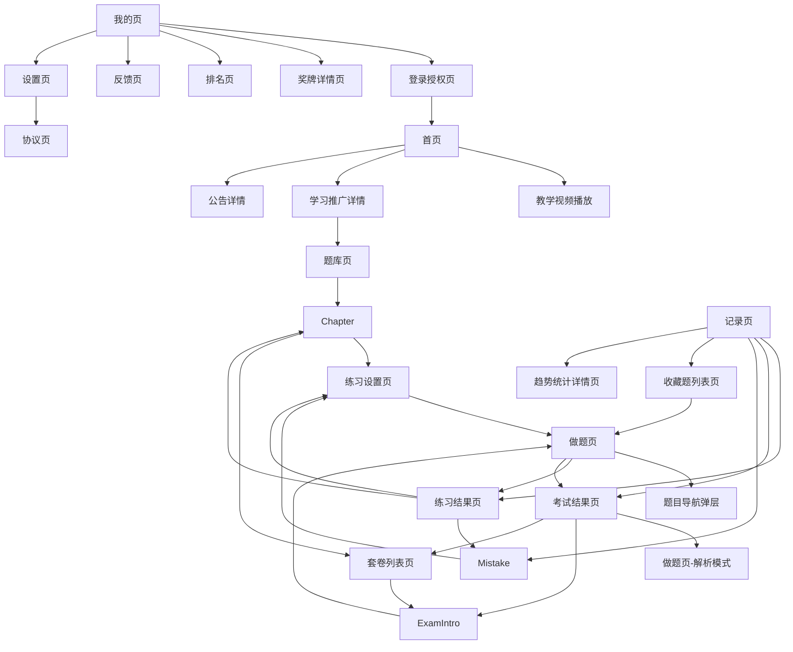
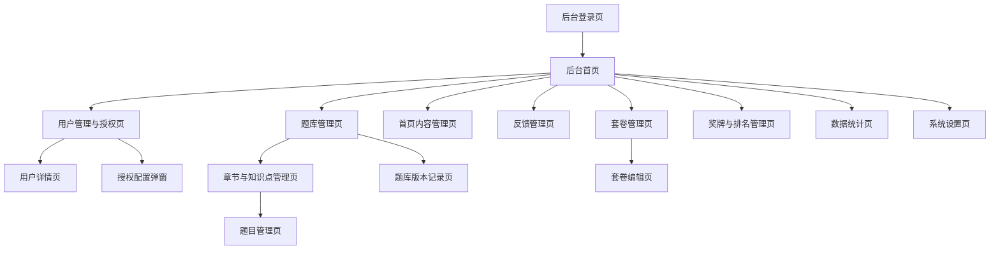

# 微信小程序页面功能与跳转关系设计文档

> 当前版本基于“考试类 + 课程类”的移动端刷题小程序场景设计，覆盖小程序页面、后台管理端页面、核心功能、布局关系和跳转流程。

## 1. 项目定位

本小程序面向需要在移动端进行题目练习、模拟考试、错题复盘和学习进度管理的用户。核心目标是降低刷题入口成本，让用户可以快速开始练习，并持续追踪学习效果。

## 2. 设计假设

- 用户通过微信授权登录，必要时补充手机号或昵称信息。
- 题库业务范围包含考试类题库和课程类题库。
- 题库按“业务类型 / 科目或课程 / 分类 / 章节 / 套卷”组织。
- 不提供付费题库、会员、兑换码或订单能力。
- 只有已注册且已由管理员授权的用户可以查看题库并进行练习。
- 做题模式包含章节练习、随机练习、专项练习、模拟考试、错题重做、收藏题练习。
- 题型仅支持客观题，包含单选、多选、判断；不支持主观题，不涉及人工批改或 AI 批改。
- 用户需要查看练习记录、错题、收藏、成绩趋势。
- 错题支持“多次答对后自动移出”和“用户手动移出”两种策略。
- 小程序需要支持题目离线缓存。
- 后台管理端负责用户授权、题库维护、内容推广、奖牌排名和反馈处理。

## 3. 信息架构

小程序采用底部 Tab 作为一级导航，建议包含 4 个主入口：

| Tab | 页面 | 主要职责 |
| --- | --- | --- |
| 首页 | `pages/home/index` | 教学视频展示、学习推广内容 |
| 题库 | `pages/bank/index` | 考试类 / 课程类题库、分类、章节、套卷选择 |
| 记录 | `pages/record/index` | 错题本、题目收藏、考试成绩、趋势统计 |
| 我的 | `pages/profile/index` | 登录信息、奖牌排名、工具区 |

## 4. 页面清单

### 4.1 首页

路径：`pages/home/index`

功能：

- 顶部展示教学视频，作为首页首屏核心内容。
- 展示学习推广内容，例如课程介绍、学习方法、活动海报、备考提醒等。
- 支持推广内容跳转到详情页、外部文章或指定题库。
- 首页不作为主要做题入口，练习入口主要放在题库页和记录页中。

布局：

- 顶部：教学视频播放器或视频封面，支持播放、暂停、全屏。
- 中部：学习推广内容列表，可采用 Banner、图文卡片或活动入口。
- 下方：更多推广内容或公告信息。

跳转：

- 点击教学视频 -> 视频播放页或当前页内播放。
- 点击推广内容 -> 推广详情页 / 文章详情页 / 指定题库页。
- 点击公告 -> 公告详情页。

### 4.2 题库页

路径：`pages/bank/index`

功能：

- 展示当前用户已被授权访问的题库科目或课程。
- 支持按分类、考试类型、难度标签筛选。
- 支持搜索题库或章节。
- 展示每个题库的题目数量、已完成数量、正确率。
- 未授权用户进入题库页时展示授权提示，不展示题库内容。

布局：

- 顶部：搜索框。
- 中部：横向分类筛选。
- 下方：题库列表，每项展示名称、描述、进度、题量。

跳转：

- 点击题库 -> 章节列表页。
- 点击搜索结果 -> 章节列表页或套卷详情页。

### 4.3 章节列表页

路径：`pages/chapter/index`

功能：

- 展示指定题库下的章节、知识点或题目分组。
- 展示章节题量、完成进度、正确率。
- 提供章节练习、随机练习、顺序练习入口。
- 支持展示离线缓存状态，例如未缓存、缓存中、已缓存、缓存需更新。

布局：

- 顶部：题库名称、总体进度。
- 中部：练习模式切换，如章节、套卷、专项。
- 下方：章节列表。
- 底部：固定按钮“开始综合练习”，并提供缓存当前题库或章节的入口。

跳转：

- 点击章节 -> 练习设置页。
- 点击“开始综合练习” -> 练习设置页。
- 点击套卷 Tab -> 套卷列表页。
- 点击“缓存” -> 离线缓存进度弹窗。

### 4.4 练习设置页

路径：`pages/practice/settings`

功能：

- 设置做题范围、题目数量、出题顺序。
- 设置是否显示答案解析。
- 设置是否只做未做题、错题或收藏题。
- 显示预计耗时。

布局：

- 顶部：练习对象名称。
- 中部：题型、题量、顺序、解析策略等表单项。
- 底部：主按钮“开始练习”。

跳转：

- 点击“开始练习” -> 做题页。
- 返回 -> 章节列表页 / 题库页 / 错题列表页。

### 4.5 做题页

路径：`pages/practice/answer`

功能：

- 展示题干、选项、题号、当前进度。
- 支持单选、多选、判断等题型作答。
- 支持上一题、下一题、提交答案。
- 支持收藏、标记疑问、查看解析。
- 支持错题自动记录。
- 支持考试模式下隐藏解析，并在交卷后统一展示结果。

布局：

- 顶部：进度条、题号、倒计时或练习耗时。
- 中部：题干与选项区域。
- 下方：解析区，练习模式可答后展示，考试模式不展示。
- 底部：上一题、下一题、提交 / 完成按钮。
- 悬浮：题目列表入口、收藏按钮。

跳转：

- 点击题目列表 -> 题目导航弹层。
- 点击完成练习 -> 练习结果页。
- 考试模式点击交卷 -> 考试结果页。
- 点击返回且有未保存进度 -> 二次确认弹窗。

### 4.6 题目导航弹层

路径：做题页内弹层组件，不建议单独成页。

功能：

- 展示全部题号。
- 区分已答、未答、答错、收藏、标记疑问状态。
- 支持快速跳转到指定题目。

布局：

- 顶部：状态图例。
- 中部：题号网格。
- 底部：关闭按钮。

### 4.7 练习结果页

路径：`pages/practice/result`

功能：

- 展示本次练习总题数、正确数、错误数、正确率、耗时。
- 展示按题型或章节拆分的表现。
- 提供查看错题、再练一次、返回题库入口。

布局：

- 顶部：结果摘要。
- 中部：统计指标和薄弱点提示。
- 下方：题目明细列表。
- 底部：操作按钮。

跳转：

- 点击“查看错题” -> 错题列表页，筛选本次练习错题。
- 点击“再练一次” -> 练习设置页或直接进入做题页。
- 点击“返回题库” -> 章节列表页。

### 4.8 套卷列表页

路径：`pages/paper/index`

功能：

- 展示模拟卷、真题卷、章节卷。
- 展示题量、建议用时、已完成次数、最高分。
- 支持按年份、类型、难度筛选。

布局：

- 顶部：筛选栏。
- 下方：套卷列表。

跳转：

- 点击套卷 -> 考试说明页。

### 4.9 考试说明页

路径：`pages/exam/intro`

功能：

- 展示考试名称、题量、满分、限时、规则。
- 提醒考试中不可查看解析。
- 提供开始考试按钮。

布局：

- 顶部：考试标题。
- 中部：考试规则和计分方式。
- 底部：开始考试按钮。

跳转：

- 点击“开始考试” -> 做题页，进入考试模式。
- 返回 -> 套卷列表页。

### 4.10 考试结果页

路径：`pages/exam/result`

功能：

- 展示分数、正确率、排名或超过人数。
- 展示各题型得分情况。
- 支持查看解析、重做本卷、返回套卷列表。

布局：

- 顶部：分数和评价。
- 中部：答题统计。
- 下方：题目明细。
- 底部：操作按钮。

跳转：

- 点击“查看解析” -> 做题页，只读解析模式。
- 点击“重做本卷” -> 考试说明页或做题页。
- 点击“返回套卷” -> 套卷列表页。

### 4.11 错题列表页

路径：`pages/mistake/index`

功能：

- 展示用户错题集合。
- 支持按题库、章节、题型、时间筛选。
- 支持移出错题本。
- 支持错题重做。
- 支持多次答对后自动移出错题本，也支持用户手动移出。

布局：

- 顶部：筛选栏。
- 中部：错题统计摘要。
- 下方：错题列表。
- 底部：开始重做按钮。

跳转：

- 点击错题 -> 错题详情页或做题页只读模式。
- 点击“开始重做” -> 练习设置页或做题页。

### 4.12 收藏题列表页

路径：`pages/favorite/index`

功能：

- 展示用户收藏题。
- 支持按题库、章节、题型筛选。
- 支持取消收藏。
- 支持收藏题专项练习。

布局：

- 顶部：筛选栏。
- 下方：收藏题列表。
- 底部：开始练习按钮。

跳转：

- 点击题目 -> 题目详情页或做题页只读模式。
- 点击“开始练习” -> 做题页。

### 4.13 记录页

路径：`pages/record/index`

功能：

- 提供错题本入口，展示错题数量和最近新增错题。
- 提供题目收藏入口，展示收藏题数量。
- 展示考试成绩，支持查看历史考试结果。
- 展示趋势统计，例如正确率趋势、考试成绩趋势、做题数量趋势。

布局：

- 顶部：学习数据概览，展示总做题数、正确率、考试次数等核心指标。
- 中部：错题本、题目收藏、考试成绩三个快捷入口。
- 中部：趋势统计图表区域。
- 下方：最近考试成绩或最近练习记录列表。

跳转：

- 点击“错题本” -> 错题列表页。
- 点击“题目收藏” -> 收藏题列表页。
- 点击考试成绩 -> 考试结果页。
- 点击趋势统计 -> 趋势统计详情页。
- 点击最近记录 -> 练习结果页或考试结果页。

### 4.14 我的页

路径：`pages/profile/index`

功能：

- 展示用户登录信息，包括头像、昵称、手机号等基础信息。
- 未登录时提供明显的登录按钮。
- 展示用户已获取的奖牌、勋章或成就。
- 展示用户排名情况，包括总榜排名、周榜排名和个人当前排名。
- 提供工具区，承载反馈、设置、协议等后续可扩展工具。

布局：

- 顶部：用户信息区，未登录时展示登录按钮。
- 中部：奖牌与排名区域。
- 下方：工具区，采用宫格或列表形式，先预留反馈等入口。

跳转：

- 点击登录 -> 登录授权页。
- 点击奖牌 -> 奖牌详情页。
- 点击排名 -> 排名页。
- 点击反馈 -> 反馈页。
- 点击设置 -> 设置页。

### 4.15 登录授权页

路径：`pages/auth/login`

功能：

- 引导用户完成微信授权登录。
- 获取用户基础信息。
- 可选获取手机号。
- 登录成功后回到原目标页面。

布局：

- 顶部：产品名称和简短说明。
- 中部：授权按钮。
- 下方：隐私协议入口。

跳转：

- 登录成功 -> 返回来源页。
- 点击隐私协议 -> 协议页。

### 4.16 设置页

路径：`pages/settings/index`

功能：

- 查看账号信息。
- 设置练习偏好，例如答后显示解析、默认题量。
- 查看隐私协议、用户协议。
- 退出登录。

布局：

- 表单项和菜单列表。

跳转：

- 点击协议 -> 协议页。
- 点击退出登录 -> 我的页。

## 5. 核心跳转关系

## 6. 关键业务流程

### 6.1 首次进入小程序

1. 用户进入首页。
2. 首页展示教学视频和学习推广内容，未登录状态下也可浏览公开内容。
3. 用户点击需要登录的功能。
4. 跳转登录授权页。
5. 登录成功后返回原目标页面。

### 6.2 章节练习流程

1. 用户从题库页进入题库，也可以从首页推广内容跳转到指定题库。
2. 选择章节。
3. 进入练习设置页。
4. 设置题量、顺序、解析策略。
5. 开始做题。
6. 完成后进入练习结果页。
7. 用户可查看错题、再练一次或返回章节。

### 6.3 模拟考试流程

1. 用户从题库页进入套卷列表，也可以从首页推广内容跳转到指定套卷。
2. 选择套卷。
3. 阅读考试说明。
4. 开始考试。
5. 考试中显示倒计时，不展示答案解析。
6. 用户主动交卷或倒计时结束自动交卷。
7. 进入考试结果页。
8. 用户可查看解析或重做本卷。

### 6.4 错题复盘流程

1. 用户从记录页进入错题列表。
2. 筛选题库、章节或题型。
3. 开始错题重做。
4. 答对后可根据策略自动移出错题本，或保留历史错题记录。
5. 完成后进入练习结果页。

### 6.5 收藏题练习流程

1. 用户在做题页点击收藏。
2. 收藏题进入收藏题列表。
3. 用户从记录页进入收藏题。
4. 选择题目查看，或批量开始收藏题练习。

### 6.6 首页内容浏览流程

1. 用户进入首页。
2. 顶部查看教学视频，可直接播放或进入视频播放页。
3. 向下浏览学习推广内容。
4. 点击推广内容后进入详情页，详情页可按运营配置跳转到题库、套卷、活动或外部文章。

### 6.7 我的页个人信息流程

1. 用户进入我的页。
2. 未登录时点击登录按钮进入登录授权页。
3. 已登录时查看头像、昵称、奖牌和排名信息。
4. 点击奖牌进入奖牌详情页，点击排名进入排名页。
5. 点击工具区入口进入反馈、设置等工具页面。

## 7. 页面状态设计

### 7.1 登录态

| 状态 | 页面表现 |
| --- | --- |
| 未登录 | 首页可浏览视频和推广内容；记录页、我的页的个人数据区提示登录 |
| 已登录未授权 | 我的页显示用户信息；题库页提示等待管理员授权，不展示题库 |
| 已登录已授权 | 题库页展示授权题库；记录页显示错题、收藏、成绩、趋势；我的页显示用户信息、奖牌和排名 |
| 登录过期 | 弹窗提示重新登录，保留当前目标页面 |

### 7.2 数据空状态

| 场景 | 空状态文案 | 操作 |
| --- | --- | --- |
| 无错题 | 暂无错题，继续保持 | 去练习 |
| 无收藏 | 暂无收藏题 | 去题库 |
| 无记录 | 暂无练习记录 | 开始练习 |
| 无奖牌 | 暂未获得奖牌 | 去练习 |
| 无排名 | 暂无排名数据 | 稍后查看 |
| 无推广内容 | 暂无学习内容 | 稍后重试 |
| 无题库 | 暂无可用题库 | 联系管理员或稍后重试 |
| 未授权题库 | 暂未开通题库权限 | 联系管理员 |

### 7.3 异常状态

| 场景 | 处理方式 |
| --- | --- |
| 网络异常 | 展示重试按钮，保留页面上下文 |
| 题目加载失败 | 提示重新加载，不清空已答状态 |
| 交卷失败 | 本地临时保存答题数据，允许重试提交 |
| 登录失败 | 返回登录页，提示失败原因 |
| 授权失效 | 清空受限题库入口和离线缓存，提示重新联系管理员 |
| 离线缓存失败 | 展示失败原因，允许重新缓存 |

## 8. 权限与缓存规则

### 8.1 题库访问权限

- 首页教学视频和学习推广内容默认可浏览，具体内容是否需要登录可由后台配置。
- 题库页、章节列表页、做题页、错题本、收藏题和考试成绩需要用户登录。
- 用户登录后仍需管理员授权，才可以查看被授权的考试类或课程类题库。
- 授权范围可以精确到业务类型、题库、课程、章节或套卷，第一阶段建议精确到题库或课程。
- 后端接口必须按用户授权范围过滤题库数据，前端只负责展示授权结果。

### 8.2 离线缓存规则

- 用户只能缓存自己已被授权访问的题目。
- 缓存内容包含题干、选项、正确答案、解析、题型、章节、套卷归属和版本号。
- 缓存不包含用户无权限访问的题库，也不缓存后台已下架或已撤权的题库。
- 每个题库或章节需要维护缓存版本号；版本变化时提示用户更新缓存。
- 用户授权失效后，小程序应清理对应题库的离线缓存。
- 离线作答产生的记录需要本地暂存，网络恢复后同步到后端。

## 9. 做题页交互规则

- 单选题：点击选项后立即记录答案，可根据练习设置决定是否立即显示解析。
- 多选题：点击选项切换选中状态，点击提交后判题。
- 判断题：点击“正确 / 错误”后记录答案。
- 考试模式：答题过程中不展示正确答案和解析。
- 练习模式：可配置“答后显示解析”或“完成后统一查看解析”。
- 收藏：再次点击取消收藏。
- 标记疑问：只影响用户个人标记，不影响判题。
- 错题：同一道错题连续或累计多次答对后自动移出，具体次数由后台配置；用户也可以在错题列表手动移出。
- 退出：存在未完成作答时弹窗确认，避免误退出。

## 10. 推荐页面路由命名

| 页面 | 路由 |
| --- | --- |
| 首页 | `pages/home/index` |
| 视频播放 | `pages/video/detail` |
| 推广详情 | `pages/promotion/detail` |
| 公告详情 | `pages/notice/detail` |
| 题库 | `pages/bank/index` |
| 章节列表 | `pages/chapter/index` |
| 套卷列表 | `pages/paper/index` |
| 考试说明 | `pages/exam/intro` |
| 考试结果 | `pages/exam/result` |
| 练习设置 | `pages/practice/settings` |
| 做题 | `pages/practice/answer` |
| 练习结果 | `pages/practice/result` |
| 错题 | `pages/mistake/index` |
| 收藏 | `pages/favorite/index` |
| 记录 | `pages/record/index` |
| 趋势统计详情 | `pages/record/trend` |
| 我的 | `pages/profile/index` |
| 奖牌详情 | `pages/profile/medal` |
| 排名 | `pages/profile/ranking` |
| 反馈 | `pages/feedback/index` |
| 登录 | `pages/auth/login` |
| 设置 | `pages/settings/index` |
| 协议 | `pages/agreement/index` |

## 11. 建议组件拆分

| 组件 | 用途 |
| --- | --- |
| `QuestionCard` | 展示题干、题型、选项 |
| `AnswerOption` | 单个选项 |
| `AnswerAnalysis` | 答案解析 |
| `QuestionNavigator` | 题号导航弹层 |
| `ProgressSummary` | 学习进度摘要 |
| `BankCard` | 题库列表项 |
| `ChapterCard` | 章节列表项 |
| `ResultPanel` | 结果摘要 |
| `VideoBanner` | 首页教学视频展示 |
| `PromotionCard` | 学习推广内容卡片 |
| `MedalPanel` | 用户奖牌展示 |
| `RankingPanel` | 用户排名展示 |
| `ToolGrid` | 我的页工具区 |
| `EmptyState` | 通用空状态 |
| `LoginGuard` | 登录校验包装逻辑 |

## 12. 已确认业务规则

| 事项 | 规则 |
| --- | --- |
| 题库范围 | 考试类、课程类 |
| 题库访问 | 仅注册且管理员授权的用户可以查看题库 |
| 商业能力 | 不需要付费题库、会员、兑换码、订单能力 |
| 排名范围 | 展示总榜、周榜和个人当前排名 |
| 题型范围 | 仅支持客观题，不支持主观题 |
| 批改能力 | 不涉及人工批改或 AI 批改 |
| 错题移出 | 支持多次答对后自动移出，也支持用户手动移出 |
| 离线能力 | 需要支持离线缓存题目 |
| 管理能力 | 需要后台管理端页面设计 |

## 13. 后台管理端页面设计

后台管理端建议采用 Web 管理系统，主要服务管理员、运营人员和题库维护人员。第一阶段重点是保证“用户授权 -> 题库维护 -> 内容配置 -> 数据查看”的基础链路闭环。

### 13.1 后台登录页

路径建议：`/admin/login`

功能：

- 管理员账号登录。
- 支持退出登录和登录态过期处理。
- 可预留角色权限控制。

跳转：

- 登录成功 -> 后台首页。

### 13.2 后台首页

路径建议：`/admin/dashboard`

功能：

- 展示题库数量、注册用户数、已授权用户数、今日做题数、考试次数等核心指标。
- 展示待处理反馈、最近题库更新、最近用户授权记录。

布局：

- 顶部：核心数据卡片。
- 中部：趋势图和待办事项。
- 下方：最近操作记录。

### 13.3 用户管理与授权页

路径建议：`/admin/users`

功能：

- 查看注册用户列表。
- 按昵称、手机号、注册时间、授权状态筛选用户。
- 给用户授权考试类或课程类题库。
- 取消用户题库授权。
- 查看用户做题记录、考试成绩、错题数量、收藏数量。

布局：

- 顶部：筛选区。
- 中部：用户表格。
- 右侧或弹窗：授权配置面板。

跳转：

- 点击用户 -> 用户详情页。
- 点击授权 -> 授权弹窗。

### 13.4 题库管理页

路径建议：`/admin/banks`

功能：

- 新增、编辑、下架题库。
- 区分考试类题库和课程类题库。
- 管理题库名称、描述、封面、分类、状态、排序。
- 查看题库题目数、章节数、套卷数、缓存版本号。
- 发布题库版本，触发小程序端缓存更新提示。

跳转：

- 点击题库 -> 章节管理页。
- 点击版本 -> 题库版本记录页。

### 13.5 章节与知识点管理页

路径建议：`/admin/banks/:bankId/chapters`

功能：

- 维护章节、知识点层级。
- 设置章节排序、启用状态。
- 查看每个章节的题目数量。

跳转：

- 点击章节 -> 题目管理页。

### 13.6 题目管理页

路径建议：`/admin/questions`

功能：

- 新增、编辑、删除、下架题目。
- 仅维护单选、多选、判断题。
- 维护题干、选项、正确答案、解析、难度、章节、标签。
- 支持批量导入题目。
- 支持按题库、章节、题型、状态、关键词筛选。

布局：

- 顶部：筛选区和批量导入按钮。
- 中部：题目表格。
- 右侧或独立页面：题目编辑表单。

### 13.7 套卷管理页

路径建议：`/admin/papers`

功能：

- 新增、编辑、发布、下架套卷。
- 维护套卷题目、题量、限时、满分、排序。
- 支持从题库中选题组卷。
- 查看套卷考试次数和平均分。

跳转：

- 点击套卷 -> 套卷编辑页。

### 13.8 首页内容管理页

路径建议：`/admin/content/home`

功能：

- 配置首页顶部教学视频。
- 维护学习推广内容、Banner、公告。
- 设置推广内容跳转目标，例如推广详情、题库、套卷或外部文章。
- 设置内容上下架、排序和展示时间。

### 13.9 奖牌与排名管理页

路径建议：`/admin/gamification`

功能：

- 配置奖牌规则，例如累计做题数、连续学习天数、考试达标次数。
- 查看用户奖牌获取记录。
- 配置总榜和周榜统计口径。
- 查看用户个人当前排名。

### 13.10 数据统计页

路径建议：`/admin/statistics`

功能：

- 查看用户做题趋势、正确率趋势、考试成绩趋势。
- 查看题库使用情况、章节正确率、题目错误率。
- 支持导出基础统计数据。

### 13.11 反馈管理页

路径建议：`/admin/feedback`

功能：

- 查看小程序用户反馈。
- 按处理状态、反馈类型、提交时间筛选。
- 标记处理中、已解决、忽略。
- 可记录处理备注。

### 13.12 系统设置页

路径建议：`/admin/settings`

功能：

- 配置错题自动移出次数。
- 配置离线缓存策略和缓存版本规则。
- 配置题库默认授权范围。
- 配置管理员账号和角色权限。

### 13.13 后台核心跳转关系

## 14. 第一阶段 MVP 建议

第一阶段建议优先实现以下页面：

1. 首页
2. 题库页
3. 章节列表页
4. 练习设置页
5. 做题页
6. 练习结果页
7. 记录页
8. 错题列表页
9. 收藏题列表页
10. 套卷列表页
11. 考试说明页
12. 考试结果页
13. 我的页
14. 登录授权页
15. 后台登录页
16. 后台首页
17. 用户管理与授权页
18. 题库管理页
19. 章节管理页
20. 题目管理页
21. 套卷管理页
22. 首页内容管理页
23. 反馈管理页
24. 系统设置页

第一阶段同步实现的关键能力：

- 管理员授权后用户才可查看题库。
- 客观题做题、判题、解析展示。
- 错题本和题目收藏。
- 考试成绩记录。
- 总榜、周榜和个人当前排名的基础展示。
- 题目离线缓存和缓存版本更新提示。

暂缓实现：

- 复杂奖牌规则
- 班级管理
- 复杂趋势图
- 高级数据导出
- 多角色细粒度权限

这样可以先闭环“首页内容展示 -> 授权用户选题 -> 做题或考试 -> 结果 -> 记录复盘 -> 我的个人信息 -> 后台维护题库与授权”的主路径，再逐步扩展复杂奖牌、运营活动和更多工具能力。
